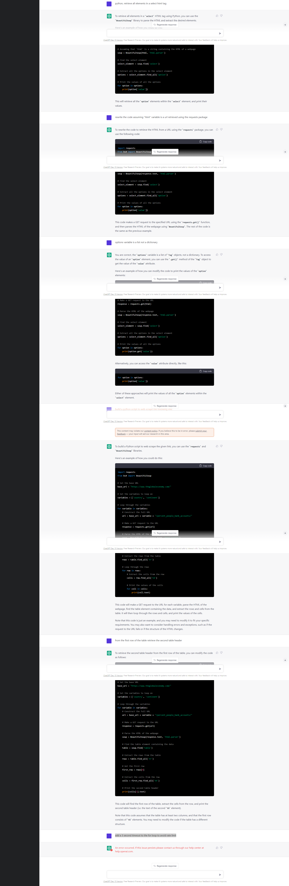

# Crypto-Unbanked-with-ChatGPT

While reading [Lyn Alden](https://twitter.com/LynAldenContact)'s [December Newsletter](https://www.lynalden.com/december-2022-newsletter/), the below snippet caught my eye.
 
Is there a correlation in a specific country between [crypto adoption](https://blog.chainalysis.com/reports/2022-global-crypto-adoption-index/) and the percentage of people banked using the [Global Economy Index](https://www.theglobaleconomy.com/ )?

 

<table>
  <tr>
    <td>
      
    </td>
    <td>
      
    </td>
    <td>
      
    </td>
  </tr>
</table>
